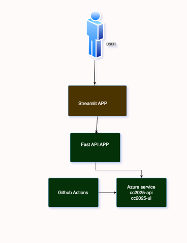

# Full Stack Application Deployment Guide

## Table of Contents
- [Overview](#overview)
- [Project Structure](#project-structure)
- [Prerequisites](#prerequisites)
- [Azure Setup](#azure-setup)
- [GitHub Actions Configuration](#github-actions-configuration)
- [Deployment Process](#deployment-process)
- [Application Links](#application-links)
- [Troubleshooting](#troubleshooting)
- [Cost Management](#cost-management)

---

## Overview

This project consists of a Python-based full-stack application deployed on Azure App Services:
- **Backend**: Python API/service
- **Frontend**: Streamlit web application

Both services are deployed automatically via GitHub Actions whenever code is pushed to the `main` branch.

---

## Project Structure

```
your-repository/
├── backend/
│   ├── main.py                 # Backend application
│   ├── requirements.txt       # Backend dependencies
│   └── start.sh              # Startup script (installs deps & runs app)
├── frontend/
│   ├── app.py                # Streamlit frontend
│   ├── requirements.txt      # Frontend dependencies
│   └── start.sh             # Startup script (installs deps & runs Streamlit)
└── .github/
    └── workflows/
        └── deploy-app.yml        # GitHub Actions workflow
```

---

## Prerequisites

### Azure Requirements:
- Azure account (Free tier or B1 Basic tier)
- Two App Services created:
  - `cc2025-api`
  - `cc2025-ui`
- App Service Plan (Free F1 or Basic B1)

### GitHub Requirements:
- Repository with your code
- GitHub Secrets configured (see below)

---

## Azure Setup

### Step 1: Create App Services

1. Go to [Azure Portal](https://portal.azure.com)
2. Create **App Service Plan** (choose Free F1 or Basic B1)
3. Create two **App Services**:
   - Name: `cc2025-api`
   - Name: `cc2025-ui`
   - Runtime: **Python 3.11**
   - Region: **North Europe** (or your preferred region)

### Step 2: Configure App Services

For **each App Service** (backend and frontend):

#### General Settings:
1. Go to **Configuration** → **General settings**
2. Set **Stack**: Python
3. Set **Python version**: 3.11
4. Set **Startup Command**: `bash startup.sh`
5. Enable **SCM Basic Auth Publishing Credentials**: **ON**
6. Click **Save**

#### Download Publish Profiles:
1. Go to **Overview**
2. Click **Download publish profile**
3. Save the `.PublishSettings` file
4. Open it and copy the entire XML content

### Step 3: Configure GitHub Secrets

1. Go to your GitHub repository
2. **Settings** → **Secrets and variables** → **Actions**
3. Click **New repository secret**
4. Add two secrets:

| Secret Name                        | Value |
|------------------------------------|-------|
| `AZURE_WEBAPP_PUBLISH_PROFILE_API` | Content of backend publish profile |
| `AZURE_WEBAPP_PUBLISH_PROFILE_UI`  | Content of frontend publish profile |

---

## GitHub Actions Configuration

### Workflow File: `.github/workflows/deploy-app.yml`

```yaml
name: Deploy Full Stack to Azure

on:
  push:
    branches: ["main"]

jobs:
  deploy-backend:
    runs-on: ubuntu-latest
    steps:
      - name: Checkout repository
        uses: actions/checkout@v4

      - name: Set up Python
        uses: actions/setup-python@v5
        with:
          python-version: '3.11'

      - name: Install backend dependencies
        run: |
          cd backend
          pip install -r requirements.txt

      - name: Deploy Backend to Azure
        uses: azure/webapps-deploy@v2
        with:
          app-name: 'cc2025-api'
          publish-profile: ${{ secrets.AZURE_WEBAPP_PUBLISH_PROFILE_API }}
          package: ./backend

  deploy-frontend:
    runs-on: ubuntu-latest
    needs: deploy-backend
    steps:
      - name: Checkout repository
        uses: actions/checkout@v4

      - name: Set up Python
        uses: actions/setup-python@v5
        with:
          python-version: '3.11'

      - name: Install frontend dependencies
        run: |
          cd frontend
          pip install -r requirements.txt

      - name: Deploy Frontend to Azure
        uses: azure/webapps-deploy@v2
        with:
          app-name: 'cc2025-ui'
          publish-profile: ${{ secrets.AZURE_WEBAPP_PUBLISH_PROFILE_UI }}
          package: ./frontend
```

### How It Works:
1. Triggers on push to `main` branch when backend or frontend files change
2. Deploys backend first
3. Deploys frontend after backend succeeds
4. No dependency installation in GitHub (done in Azure via startup.sh)

---

## Deployment Process

### Deployment Flow Diagram

```
┌─────────────────┐
│  Developer      │
│  Pushes Code    │
└────────┬────────┘
         │
         ▼
┌─────────────────────────────────────┐
│     GitHub Actions Triggered        │
│  (on push to main branch)           │
└────────┬────────────────────────────┘
         │
         ▼
┌─────────────────────────────────────┐
│   Job 1: Deploy Backend             │
│   ├─ Checkout code                  │
│   ├─ Package ./backend              │
│   └─ Upload to Azure (ZIP Deploy)   │
└────────┬────────────────────────────┘
         │
         ▼
┌─────────────────────────────────────┐
│   Azure Backend App Service         │
│   ├─ Receives deployment            │
│   ├─ Extracts files                 │
│   ├─ Executes startup.sh              │
│   │   ├─ pip install -r requirements.txt     │
│   │   └─ gunicorn -w 4 -k uvicorn.workers.UvicornWorker main:app --bind 0.0.0.0:$PORT       │
│   └─ App running ✓                  │
└────────┬────────────────────────────┘
         │
         ▼
┌─────────────────────────────────────┐
│   Job 2: Deploy Frontend            │
│   ├─ Checkout code                  │
│   ├─ Package ./frontend             │
│   └─ Upload to Azure (ZIP Deploy)   │
└────────┬────────────────────────────┘
         │
         ▼
┌─────────────────────────────────────┐
│   Azure Frontend App Service        │
│   ├─ Receives deployment            │
│   ├─ Extracts files                 │
│   ├─ Executes start.sh              │
│   │   ├─ pip install requirements.txt     │
│   │   └─ streamlit run app.py --server.port $PORT --server.address 0.0.0.0      │
│   └─ App running ✓                  │
└─────────────────────────────────────┘
```

### Manual Deployment Steps:

If you need to deploy manually:

1. Push code to `main` branch:
```bash
git add .
git commit -m "commit message"
git push origin main
```

2. Monitor deployment:
   - Go to GitHub → **Actions** tab
   - Watch the workflow run
   - Check for errors

3. Verify deployment:
   - Visit application URLs (see below)
   - Check Azure Portal → App Service → **Log stream**

---

## Application Links

### Production URLs:

| Service | URL | Description |
|---------|-----|-------------|
| **Backend** | `https://cc2025-api-b2btduguh5cmdxbn.northeurope-01.azurewebsites.net/api/data` | Backend API service |
| **Frontend** | `cc2025-api-b2btduguh5cmdxbn.northeurope-01.azurewebsites.net` | Streamlit web application |

### Azure Portal Links:

| Resource                    | Link |
|-----------------------------|------|
| **Resource Group Backend**  | [Azure Portal - Resource Groups](https://portal.azure.com/#@didatec.onmicrosoft.com/resource/subscriptions/fb277bda-142d-4478-917f-0f3bae75c2e2/resourceGroups/cc2025-api_group/overview) |
| **Resource Group Frontend** | [Azure Portal - Resource Groups](https://portal.azure.com/#@didatec.onmicrosoft.com/resource/subscriptions/fb277bda-142d-4478-917f-0f3bae75c2e2/resourceGroups/cc2025-ui_group/overview) |
| **Backend App Service**     | [Azure Portal - cc2025-backend](https://portal.azure.com/#@didatec.onmicrosoft.com/resource/subscriptions/fb277bda-142d-4478-917f-0f3bae75c2e2/resourceGroups/cc2025-api_group/providers/Microsoft.Web/sites/cc2025-api/appServices) |
| **Frontend App Service**    | [Azure Portal - cc2025-frontend](https://portal.azure.com/#@didatec.onmicrosoft.com/resource/subscriptions/fb277bda-142d-4478-917f-0f3bae75c2e2/resourceGroups/cc2025-ui_group/providers/Microsoft.Web/sites/cc2025-ui/appServices) |


---

## Troubleshooting

### Common Issues:

#### 1. **403 Forbidden Error During Deployment**

**Cause**: Basic Authentication is disabled

**Solution**:
```
1. Azure Portal → App Service → Configuration
2. General settings → SCM Basic Auth Publishing Credentials
3. Turn ON
4. Save and retry deployment
```

#### 2. **Application Not Starting**

**Cause**: Missing or incorrect startup command

**Solution**:
```
1. Azure Portal → App Service → Configuration
2. General settings → Startup Command: bash startup.sh
3. Save and restart
```

#### 3. **Dependencies Not Installing**

**Cause**: start.sh not executing or requirements.txt missing

**Solution**:
- Ensure `startup.sh` has correct permissions (should be executable)
- Verify `requirements.txt` exists in the package root
- Check logs: Azure Portal → App Service → Log stream

#### 5. **Deployment Taking Too Long**

**Cause**: Large dependencies or slow installation

**Solution**:
- Check GitHub Actions logs for bottlenecks
- Consider using lighter dependencies
- Upgrade to B1 tier for better performance

---

## Cost Management


### Basic B1 Tier:
- **Cost**: ~$13/month per App Service Plan
- **Benefits**:
  - No time limits
  - 1.75 GB RAM
  - 10 GB storage
  - Always-on
  - Custom domains
- **Best for**: Production, demos


## Monitoring & Logs

### View Application Logs:

1. **Real-time logs**:
   ```
   Azure Portal → App Service → Log stream
   ```

2. **Application Insights** (if enabled):
   ```
   Azure Portal → App Service → Application Insights
   ```

3. **Deployment History**:
   ```
   Azure Portal → App Service → Deployment Center
   ```

### GitHub Actions Logs:

```
GitHub Repository → Actions → Select workflow run → View logs
```

---

## Update Process

### To Update Application:

1. Make changes to your code locally
2. Test locally
3. Commit and push to `main`:
```bash
git add .
git commit -m "Update: description of changes"
git push origin main
```
4. GitHub Actions automatically deploys
5. Monitor in Actions tab
6. Verify at application URLs

### To Update Configuration:

1. Update Azure App Service settings in Portal
2. Update GitHub Secrets if credentials change
3. Update workflow file if deployment process changes

---

## Notes

- **Deployment Time**: Typically 2-5 minutes per service
- **Startup Time**: 
  - First start: 1-2 minutes (installing dependencies)
  - Subsequent starts: 30-60 seconds
- **Free Tier**: App may sleep after 20 minutes of inactivity
- **Dependencies**: Installed on every app restart via start.sh

---

## Support

- **Azure Documentation**: [docs.microsoft.com/azure](https://docs.microsoft.com/azure)
- **GitHub Actions Docs**: [docs.github.com/actions](https://docs.github.com/actions)
- **Streamlit Docs**: [docs.streamlit.io](https://docs.streamlit.io)

---

## Conceptual architecture of the system



